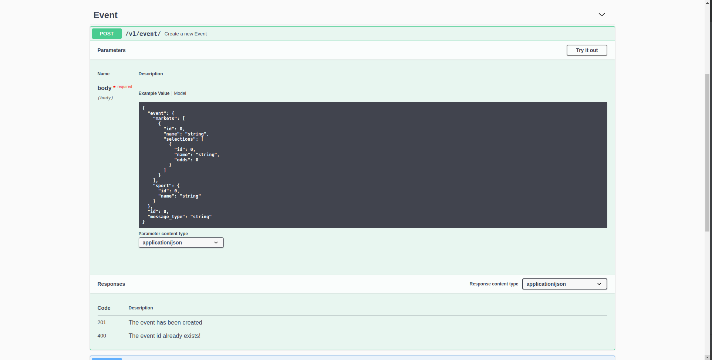

888-spectate-interview-project
------------------------------
Motivation
===========
Betbright is a sports betting platform. The main functional areas are:

- Manage data about sporting events to allow users to place bets.
- Provide API to receive data from external providers and update our system with the latest data about events in real time.
- Provide access to support team to allow the to see the most recent data for each event and to query data.

Tech Stack
======================

For this API were chosen as stack:

- Flask
- Flask Restful
- MongoDB
- Pymongo
- Marshmallow
- Flasgger
- Docker

Install
==========

First of all clone this project and access it's root folder

1 - API Docker Installation
===========================

To install and run the api just execute the following command ::

    docker-compose up --build

And access ::

    http://localhost

API Routes
============

The API Routes:

- POST '/api/v1/event'
- GET  '/api/v1/events'
- POST '/api/v1/odds'
- GET  '/api/v1/match/<event_id>'
- GET  '/api/v1/match/' (The Querystring parameters can be use: 'name', 'sport', 'ordering')

Documentation
=============

You could verify and test all the routes by accessing the API Documentation ::

    http://localhost/apidocs

Example of a Event POST:

Maintainers
-----------

- Luiz_ Felipe_ Divino_ (owner)

.. Maintainers links
.. _Luiz: https://github.com/lfdivino
.. _Felipe: https://github.com/lfdivino
.. _Divino: https://github.com/lfdivino